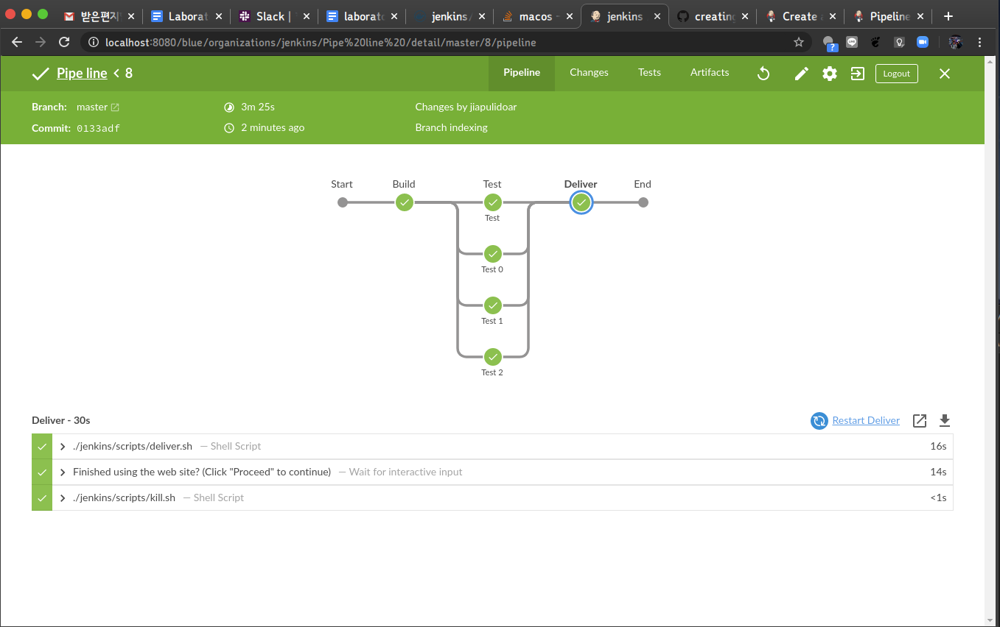

# Ingeniería de Software Lab 4 

## Integrantes: 

* Cristian Martínez Collazos
* Jimmy Alexander Pulido Arias
* Laura Vanessa Bohórquez Ramírez


## Prueba de instalación: 
> En el repositorio puede encontrar el archivo **Jenkinsfile**





## Punto 3  Datetime Constraint

Es un plugin para agregar *curfew* a los *pipelines*. Esta fecha se ajusta en la configuración luego de instalar el plugin: 


### Ejemplo de uso en el pipeline: 

Se usa la funcion curfew() y solo se ejecuta lo siguiente cuando este en una fecha y hora válida. 


```js
 stages {
    stage('Build') {
      steps {
        curfew()
        sh 'npm install'
      }
    }
```


